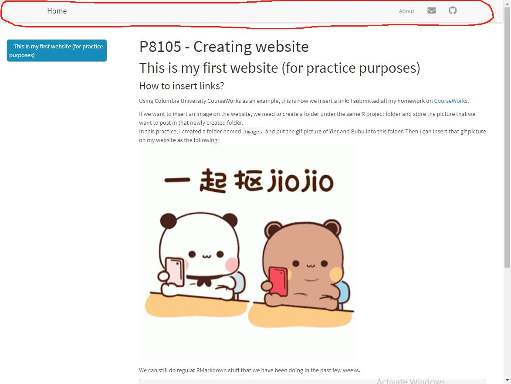
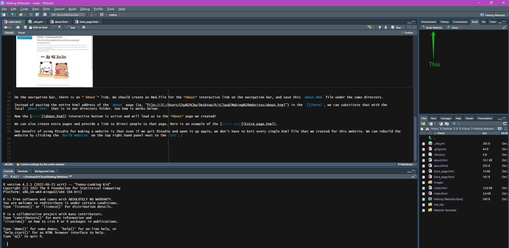
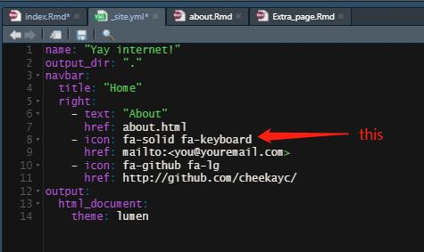

# This is my first website (for practice purposes)

### How to insert links?

Using Columbia University CourseWorks as an example, this is how we insert a link: 
I submitted all my homework on [CourseWorks](https://courseworks2.columbia.edu/).

If we want to insert an image on the website, we need to create a folder under the same R project folder and store the picture that we want to post in that newly created folder.                            
In this practice, I created a folder named `Images` and put the gif picture of Yier and Bubu into this folder. Then I can insert that gif picture on my website as the following:                             


We can still do regular RMarkdown stuff that we have been doing in the past few weeks.
```{r, message = FALSE}
library(tidyverse)

x = rnorm(1000)
mean(x)
```


### Control settings for the entire website

It’s better to have one set of rules that apply site-wide. To do this, we’ll create a single file with all the YAML stuff we need, and at the same time remove extraneous YAML header content from individual
Rmd files. Meaning we can then remove the `theme: whatever theme we choose` from the header because we no longer need to specify that in the header.

Create your `_site.yml` file by going to File > New File > Text file. Copy the content below, and save the file as `_site.yml` in your project’s home folder.

We now have a navigation bar on top of the website that is interactive.


On the navigation bar, there is an *`About`* link. We should create an Rmd.file for the *About* interactive link on the navigation bar, and save this `about.Rmd` file under the same directory.

Instead of pasting the entire html address of the `about` page (ie. "file:///C:/Users/Chu%20Chu/Desktop/R/iCloud/Making%20Websites/about.html") in the `[](here)`, we can substitute that with the
local `about.html` that is in our directory folder. See how it works below:

Now the [About](about.html) interactive button is active and will lead us to the *About* page we created!

We can also create extra pages and provide a link to direct people to that page. Here is an example of the [extra page](Extra_page.html).

One benefit of using RStudio for making a website is that even if we quit RStudio and open it up again, we don't have to knit every single html file that we created for this website. We can rebuild the website by clicking the `Build Website` on the top right hand panel next to the `Git`. 


### Playing with icons

We can change the icons (ie. the envelope icon) on the navigation bar into something else, and we can choose the icons from this [fontawesome](https://fontawesome.com/icons) website.                        
Let's say we would like to change the envelope icon into keyboard icon.                                                                                                                               
Step 1: go to [fontawesome](https://fontawesome.com/icons) website and search for the keyboard icon.                                                                                                        
Step 2: copy the code snippet for the icon selected. In this case, the keyboard icon code snippet is **fa-solid fa-keyboard**.                                                                               
Step 3: Go to the `_site.yml` file and change the input for icon. Save the file.



Done. Now let's knit to see if the envelope icon has become a keyboard icon. It works!


